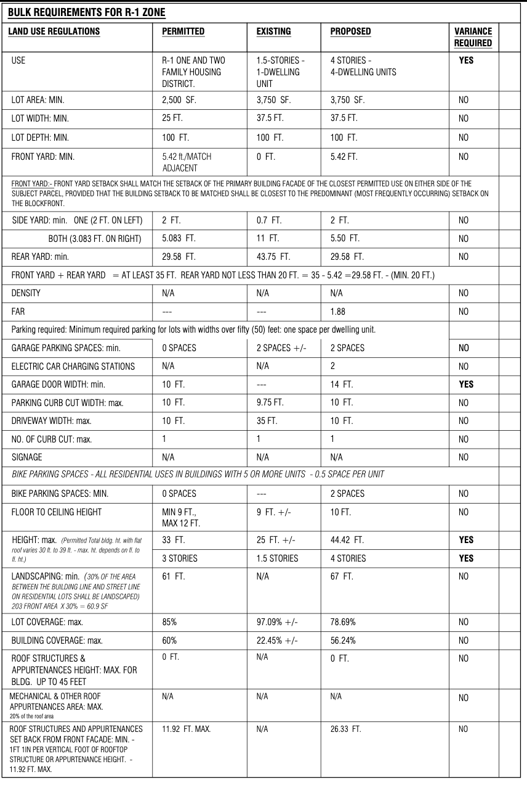
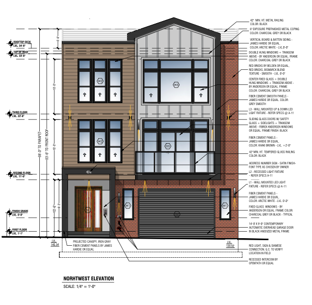

# Deciphering the Architectural Plan

Architectural drawings provide a way for developers to communicate hundreds of design and construction details to contractors, city officials, and the community in concise and readable way. But even a simple 2-family building is a complicated undertaking that requires a dozen of more pages of complicated drawings. Here are the bits you should focus on first.&#x20;

## Zoning Summary

Every set of plans will have a zoning summary table on the first page (this may have a different name like "Bulk Requirements"). This table should indicate the zone the property is located in (e.g. R-1, R-2, etc.) and summarize the regulated characteristics of the project including number of dwelling units, building height, setbacks, and parking. For each regulated characteristic, the table indicates what is permitted, what currently exists on the site, and what is proposed. If the proposed development exceeds what is permitted, a variance (think "waiver") will be required.

<figure><figcaption>
Typical zoning summary table for a proposed project in Jersey City's R-1 zone.
</figcaption></figure>

## Elevation(s)

Another important thing to locate are elevations. These illustrations show what the proposed building(s) will look like when construction is completed, and contain a lot of useful information about dimensions that can help you understand what is being proposed. Larger buildings, or those on corner lots, may have multiple elevations looking in different directions (elevations are labeled by the direction the shown portion faces).

<figure><figcaption>
A typical elevation drawing shows dimensions, materials, and other details on building design.
</figcaption></figure>
